# MOESI developer experience: Orchestra and SRA

> Historical record from 2026-09-28. Repository, package, schema, tooling, and
> application-status statements below describe the recorded checkpoints. See the
> [current README](../README.md) and later acceptance records for current behavior.

Reviewed 2026-09-28. **MOESI 0.14 has a tested deployment core, but neither
application can adopt it with full workflow coverage today.** Completing the
earlier foundation/release work does not establish application readiness.

This review covers the developer lifecycle exposed by the two repositories:
installation, authoring/import, address prediction, observation, fleet drift,
planning, review, authority, submission, verification, interruption/recovery,
operations, diagnostics, automation, testing, and upgrade/cutover. It reviews
browser interaction and integration contracts from source; it is not a visual
accessibility audit or a claim that a migrated application ran successfully.

The recommendation is to close the address/identity and fleet-plan gaps first,
then prove the two actual consumers. Do not recreate the retired package graph
or hide missing behavior behind an old resolver or settlement implementation.

## Baseline and evidence

| Repository or distribution | Baseline inspected | Consequence |
| --- | --- | --- |
| MOESI upstream `main` | [`f45aad8`](https://github.com/leekt/moesi/commit/f45aad8e5b1c02e2e31af4c389e77ac3bdd43903), source/package version 0.14.0 | Reviewed implementation. The clean `moesi-release-014` checkout at `d2a22f7` has the identical tracked tree, verified with `git diff --quiet`. |
| Orchestra upstream `main` and local checkout | [`1c5b2ff`](https://github.com/zerodevapp/orchestra-web/commit/1c5b2ff6c747be1e961f8e900e1864c05da5cec7) | Frontend/backend use `moesi@0.12.0` and `@moesi/settle-zerodev@0.12.0`; the latter also has a local patch. |
| SRA upstream `master` | [`cb980c6`](https://github.com/zerodevapp/sra-dashboard/commit/cb980c6acb54e7bdb575538a4044f9fcf4d0475e) | Uses `moesi`/settle-zerodev `^0.8.7` plus the old `@moesi/*` package family. Read from a separate clean checkout; the original local SRA checkout is older. |
| npm registry, queried during this review | `moesi` 0.13.0; `@moesi/cli` 0.13.0; `@oaath/sdk` 0.1.0 | The reviewed 0.14.0/0.2.0 combination requires exact tarballs today. An ordinary latest-version installation is a different product. |
| Original `moesi` working directory | `78b461e` plus existing uncommitted CLI/probe work | [Earlier usability review](ux-review.md) describes those local changes. It does not prove they shipped in 0.14. All pre-existing edits were preserved. |

The [offline packed-consumer probe](../scripts/fixtures/dx-review-probe.mjs) and its
[captured results](dx-review/evidence.json) reproduce schema/API/CLI limitations
without RPC. The [Paris probe](../scripts/fixtures/dx-review-probe-paris.mjs) and
[result](dx-review/paris-evidence.json) reproduce a capability false positive on
local Anvil. Tarball SHA-256 values are retained with the evidence.

The candidate input shapes in the offline probe illustrate capabilities the
current schema cannot express. They are not proposed APIs or tests requiring
those limitations to remain. The source types and implementations independently
establish the limitations.

## Findings that determine adoption

### G1 — Existing deployment addresses and smart-account identity cannot all be represented

**Blocks SRA deployment; blocks a subset of Orchestra recipes.** SRA's
AcrossAdapter and MultiPairChainlinkResolver use sender-protected CreateX
CREATE3 with the fixed Kernel address as sender. The supported CREATE3 variant
is unguarded. Protected CREATE2 accepts only `owner-eoa`, not a smart-account
sender. Orchestra also represents sender-protected CREATE3 and
crosschain-protected CreateX recipes. [SRA manifest][S-manifest],
[SRA address derivation][S-deploy], [Orchestra recipe kinds][O-contract],
[current manifest types][M-manifest], [address compiler][M-target].

The packed probe rejects the protected-CREATE3 candidate with
`invalid_deployment` and protected CREATE2 with a smart-account sender with
`invalid_sender`. Substituting unguarded CREATE3 changes SRA's addresses:

| Default SRA `TxTwoV4` recipe | SRA protected prediction | Current unguarded prediction |
| --- | --- | --- |
| AcrossAdapter | `0xAFdEA3e6716239482c2378a3bf6D24fBDd99B077` | `0x2aed175e51f2166cfcf4a2b7a4671f914e996040` |
| MultiPairChainlinkResolver | `0xD91B39e398490AbAAdc79011524D28E6854EF48d` | `0x2cb61658d9a3961ab850ff7a4b2b18380e55724b` |

These are offline predictions using checked-in inputs, not live deployment
attestations. A new API/schema is allowed; changing the fleet's intended
addresses, owners, or constructor inputs is not an API migration.

Owner: MOESI owns strategy compilation and exact sender requirements; OAAth owns
account identity/derivation. First proof: real CreateX on local chains, existing
SRA vectors, two distinct sender identities, wrong-sender rejection before any
submission, and identical address/calldata in browser preview, server plan,
exported manifest, and execution. Pin Kernel implementation/version and
configuration; never assume a newly created OAAth account is the existing fleet
or organization's account.

### G2 — One reviewed fleet plan cannot contain chain-specific resources or values

**Blocks SRA fleet parity.** `MoesiManifest` contains one flat `contracts` array.
The planner applies every resource to every selected chain, deriving its address
without a chain argument. There is no resource chain selector, per-chain init
code, runtime hash, constructor value, or configuration override. SRA varies
spoke pools, token addresses, route matrices, fee tiers, feed constructors and
resource applicability by chain. [Current planner][M-plan],
[manifest types][M-manifest], [SRA topology compiler][S-manifest].

The packed probe shows identical configuration calldata on two chains and
rejects a resource `chains` field. SRA's catalog currently has 21 chains, which
fits MOESI's 32-chain bound; the blocker is heterogeneous definitions, not that
limit. Orchestra's catalog/probe endpoints can select larger sets, so it also
needs explicit partitioning rather than accidental rejection at 33 chains.

Separate per-chain manifests can support a limited adapter, but they do not
prove one immutable all-chain plan, review, Grant, and recoverable Run for the
whole intended fleet. Do not report this workaround as full multichain support.
Owner: MOESI's manifest/plan codecs. First proof: one plan with two chains,
different constructor/configuration bytes, a resource present on only one chain,
and chain-specific runtime identities; no call or assertion leaks to the other
chain. Bump every affected persisted schema in the same change.

### G3 — Artifact-to-reviewed-manifest authoring is still an application burden

**Blocks faithful exports and creates substantial migration work.** Current
resources require literal init code and an exact deployed-runtime hash.
Reference expressions work in configuration and attestation bytes, not
constructor init code. Orchestra registration keeps creation bytecode and
constructor bytes; SRA's artifact sync keeps only ABI and creation bytecode.
Neither supplies the new complete runtime-identity contract automatically.
[Orchestra import/preview][O-registration], [export][O-export],
[SRA artifact sync][S-artifacts], [manifest types][M-manifest].

A compiler can use viem ABI encoders and resolve a finite dependency graph before
planning. That does not require restoring string interpolation or the old DSL.
It must produce literal, immutable bytes; preserve named-resource attribution;
and handle constructor dependencies, linked libraries, immutables and compiler
provenance. Hashing creation bytecode is not a runtime hash. Copying a discovered
runtime hash into desired state without review can bless existing drift.

Owner: MOESI for reusable compilation/validation; each app for catalog/topology
input. First proof: actual SRA artifact fixtures, constructor-linked resources,
runtime immutables, a changed compiler/artifact, and standalone Orchestra
JSON/YAML export that reparses to the same addresses and executable plan.
Unsupported or incomplete artifacts need actionable field diagnostics before RPC.

### G4 — Cross-chain read dependencies and route batching have no complete replacement

**Blocks SRA route correctness and its bounded-batch experience.** SRA freezes
target-chain token decimals, includes exact address-labeled evidence, suppresses
writes to absent peers, keeps unknown peers unknown, and writes only mismatched
rows in batches of at most 80. Its source shard must retain the evidence used to
derive that source's expectations. Current MOESI has same-chain runtime
prerequisites and fixed exact assertions, but no reviewed cross-chain read-to-
write dependency or peer readiness model. [SRA manifest][S-manifest],
[scanner][S-scan], [route provenance helpers][S-decimals],
[configuration execution][S-deploy], [current resource model][M-manifest].

A configuration rule currently pairs one resource-local read with one exact
write. It can express one route row. It does not directly express an arbitrary
80-row write guarded and verified by 80 independent reads. Repeating the same
batch under independent rules is not proof of equivalent gas, failure, and
verification behavior. Native-token decimals remain the explicit product
convention of 18; ERC-20 decimals require exact target-address evidence.

Owner: MOESI owns pinned evidence and deterministic configuration plans; SRA owns
route topology and its readiness policy. First proof: two source chains, a peer,
canonical and alias tokens, a native route, missing/wrong/unknown peer states,
changed decimals, and 81 mismatched rows producing reviewed bounded calls with
every row independently verified. New bytes discovered after review require a
new plan/review; provider authorization must not silently rewrite calldata.

### G5 — The SRA observation service loses its durable fleet-read model

**Blocks restart-safe dashboard parity.** SRA consumes `ObservationSnapshot`,
`FileObservationStore`, exact external read buckets, peer evidence and snapshot
diffs. Its scanner commits and reloads each source shard before publishing it,
isolates corrupt shards and serves committed evidence after an offline restart.
These are absent from the current public core. A DeploymentRun store is an
execution store, not a replacement for observation history. [SRA store][S-store],
[scanner][S-scan], [server tests][S-scan-tests], [public exports][M-exports].

MOESI offers pinned `plan`, `verify`, `discover`, and low-level observation
functions. Apps can persist their outputs, but need a new explicit validated
snapshot/provenance contract and monotonic publication policy. Current `plan`
rejects with `snapshot_unreadable` if any selected chain cannot capture its
initial snapshot; it does not return a partially observed fleet in that case.
The packed probe confirms this. Read loops are sequential; large route matrices
need measured request counts, bounded concurrency/cancellation and failure
isolation, not an assumed throughput claim. [Planner][M-plan].

Owner: MOESI for evidence representations; SRA for shard scheduling/storage and
status projections. First proof: two simultaneous scans, one unavailable chain,
one incomplete shard, an older competing write, a restart with all RPCs down,
and changed manifest identity. Preserve valid last-known evidence with explicit
freshness; never report it as a new healthy observation.

### G6 — OAAth integration exists, but application authority parity is unproven

**Blocks claiming the operator/session workflows are migrated.** MOESI correctly
separates authorization from deployment. Its OAAth adapter has real public-SDK
and process-recovery proofs. Those do not exercise Orchestra's existing
organization Kernel, passkey operator enrollment, detached approvals,
owner/browser audiences, authenticated bundler/paymaster proxies, or revocation
management. Nor do they establish SRA's fixed Kernel identity and owner-fast-path
lab behavior. [Adapter][M-oaath], [Orchestra client][O-grant-client],
[grant lifecycle][O-grant-lifecycle], [SRA lab][S-lab].

The helper compiles an all-chain union of target/selector/value limits (at most
64 distinct target/selector pairs), with a default 30-minute expiration and
per-chain operation count. Its request permits more calldata than the immutable
plan; the adapter constrains its own submissions to the plan. Orchestra's
existing UI can request chain-specific scope, optional expiry and a rolling
24-hour limit. These are not interchangeable promises. Inspect and show the
actual SDK policy rather than translating labels as if the semantics matched.
[Permission compiler][M-permission], [Orchestra policy][O-policy].

Existing insufficient Grants are not silently replaced; callers need a clear
OAAth-owned renew/revoke/request flow. Grant reuse across separately reviewed
stages must preserve each plan/provider binding. Ownership, credentials,
permission installation, operation journals and route policy stay in OAAth;
MOESI must not absorb the retired settle-zerodev implementation.

First proof: browser owner consent, operator passkey use, exact existing account,
credential-free review, denied/expired/revoked/insufficient scope, sponsor-required
failure, org/session replacement during a prompt, and reuse across two reviewed
stages. Use released/exact packed SDKs only. These are integration acceptance
requirements, not findings that the upstream SDK lacks all such capabilities.

### G7 — Transaction packs, simulation and lifecycle feedback differ materially

**Blocks equivalent Orchestra pack review and SRA execution UX.** Orchestra
estimates and packs multiple actions with call/gas/calldata limits and checks
whether the pack fits one UserOperation before an operator prompt. Current
MOESI submits exactly one reviewed action at a time; its OAAth adapter sends
`calls: [step.call]`. Provider review reports sender, route and enforcement;
it does not itself promise successful simulation, a gas estimate, funds, or
single-operation pack fit. [Orchestra packer][O-packer],
[operator gate][O-review-gate], [provider contract][M-provider],
[adapter submission][M-oaath-provider].

The plan must own grouping if grouping is supported; a provider cannot silently
repack reviewed actions or alter their failure boundaries. Contract-level
array batching (G4) and grouping several calls into one provider operation are
different requirements. Bootstrap/factory availability and sponsorship must
remain explicit prerequisites, not hidden provider switching.

`DeploymentRun` exposes `runId`, `state`, `requestStop`, and `wait`, but no public
event subscription. The store can drive application progress, yet neither app
has implemented that mapping. Do not fabricate “signed” or “submitted” from
elapsed time or a review result. First proof: a multi-action dependency pack,
an oversized pack, failed simulation, sponsored review uncertainty, rejected
wallet prompt, and status updates associated with exact step/operation IDs.

### G8 — Browser recovery needs application persistence and concurrency proofs

**Blocks reliable application execution even where a manifest is expressible.**
MOESI has atomic create/CAS store requirements, a pre-submission durable fence,
reference-only recovery, and fresh convergence. The library includes a memory
store; the CLI file store is not an exported browser/server store product.
There is no library run listing, indexed activity/history service, audience
lease, or reservation across independent runs. [Store contract][M-store],
[Run interface][M-run], [Orchestra journal ownership][O-journal].

Orchestra already owns transactional run/event/step/reservation projections and
session/tab leases. Integrate one canonical MOESI Run representation into that
boundary; avoid two state machines independently authorizing retries. Provider
operation history belongs to OAAth. Application activity may project both while
preserving their distinct meanings and immutable IDs.

SRA's run strip is an in-memory map. Its comment says to re-click after reload
because deployment is idempotent; it retains no durable MOESI Run ID or provider
reference. State convergence alone cannot establish that an earlier in-flight
configuration was never submitted. [SRA run registry][S-runs].

First proof: reload/SIGKILL after possible submission and after reference commit,
two tabs, stale CAS, same-user new-session replacement, cancelled prompt,
unreadable receipt, and reorg. Resume the same reference without a new send.
Unknown submission remains ambiguous; never turn it into a fresh apply.
At-most-once within one Run is not automatic idempotency across two new Runs.

### G9 — Adoption instructions and CLI onboarding do not match the reviewed release

**Blocks a reliable first-run experience.** The 0.14 quickstart produces JSON on
stdout then reads `plan.json` without saving it. The packed CLI accepts global
`--help` but rejects `plan --help` and `plan --out`. The current CLI README also
says CREATE3 is rejected even though unguarded CREATE3 exists. The original
worktree's help/save/guidance fixes remain unmerged into this baseline.
[CLI guide][M-cli], [captured CLI behavior](dx-review/evidence.json).

The adoption guide must name the exact distribution and removal of old
dependencies/imports. For the current CLI, explicitly redirect JSON to a new
file, handle plan exit 2/3 under `set -e`, then inspect the artifact before
provider authorization/review. Do not imply review signs nothing if the command
being shown is the separate `authorize` command, which can request consent.

Owner: MOESI CLI/docs/release packaging. First proof: follow a clean-consumer
quickstart verbatim, including saved plan, blocked/partial/no-op outcomes,
invalid source, provider change, review acceptance, interruption and offline
status. No interactive TTY or private key should be required for plan/inspect/
verify/help. An npm release and its approval remain separate from this review.

### G10 — Capability probes must not overstate chain support

**A reproduced correctness issue affecting Orchestra diagnostics.** The 0.14
`eip7702` probe returns `{ supported: true }` against Anvil configured for Paris.
It estimates a call with overridden delegation code; that does not establish
authorization-transaction activation. [Probe source][M-probes],
[local reproduction](dx-review/paris-evidence.json),
[Orchestra probe consumer][O-probes].

The original worktree contains related probe-boundary fixes and an inconclusive
7702 result, but those are not in the reviewed release. Also audit tri-state
results, malformed RPC replies, custom-network changes, factory/code presence,
opcode activation, missing state-override support and safe error codes when
moving both browser and server consumers to the root exports. The old APIs
accepted a URL; current probes require caller-owned clients.

Owner: MOESI probe boundaries, then Orchestra's diagnostic adapter/cache.
First proof: pre-activation and current local forks plus unsupported RPCs,
transport failures and malformed results. Presence is not runtime identity;
RPC inability is not an unsupported opcode; a simulator result is not an
activation certificate. Retain `unknown`/`inconclusive` in the UI and cache.

## Full workflow inventory

Status meanings: **core** = the reusable primitive exists and its current tests
passed; **adapter** = explicit application/OAAth integration is required;
**gap** = a required capability or equivalent workflow is missing;
**unproven** = the production-shaped consumer proof has not been run. A core
status never means either app is already migrated.

### Install, learn, author and import

| ID | Developer experience | Assessment and required outcome |
| --- | --- | --- |
| D01 | Install a coherent SDK/CLI/provider group | **gap**, G9: exact 0.14/0.2 tarballs work; registry latest differs. Remove old fan-out packages and the patched legacy settlement dependency. |
| D02 | Browser, Node/server and CLI imports | **core + unproven**: public root, `moesi/viem`, optional `@moesi/oaath`; packed Node consumers pass. Both actual Bun/Vite applications need production build and browser proofs. |
| D03 | Discover commands, schemas and examples | **gap**, G9: global help and four executable examples exist; command help/save workflow and app examples are incomplete. |
| D04 | Author JSON, YAML or stdin manifests | **core**: one version, bounded text, strict fields, immutable normalization and schema-level errors. Do not preserve the old `moesi.dev/v1.0` reader. |
| D05 | Import Foundry/Hardhat artifacts and constructor arguments | **adapter/gap**, G3: preserve compile inputs, libraries, ABI values and runtime identity. Existing app importers are insufficient for the new manifest. |
| D06 | Predict before RPC and export a standalone dependency closure | **adapter/gap**, G1/G3: current parsing/planning has deterministic targets, but old preview/YAML-builder imports are gone and some strategies cannot be expressed. |
| D07 | Refer to another resource and reject cycles | **core/partial**: runtime prerequisites and ABI address-word references exist; constructor address substitution must be compiled separately. |
| D08 | Declare infrastructure or import existing addresses | **core/partial**: external resources support exact checks/discovery, not repair calls; arbitrary existing-address configuration is not a managed-resource form. |
| D09 | Select chains, per-chain contracts and registry values | **gap**, G2: compile exact chain-scoped definitions without restoring ambient substitutions. |
| D10 | Handle old artifacts and releases | **core + adapter**: reject/recreate old MOESI versions; apps need an explicit cutover for old in-flight work and historical evidence. No compatibility core or silent conversion of pending authority. |

### Observe, diagnose and persist fleet state

| ID | Developer experience | Assessment and required outcome |
| --- | --- | --- |
| D11 | Observe exact runtime, calls and storage without a wallet | **core**: pinned hash/number, caller-bound reads, malformed/unavailable evidence stays unreadable. |
| D12 | Discover owners, roles and ERC-1967 slots/beacons | **core**: bounded explicit discovery and semantic checks. No claim to infer arbitrary proxy behavior, enumerate all role members or adopt state automatically. |
| D13 | Register custom chains/RPCs and verify their identity | **adapter**: caller-owned viem transports; retain exact chain/origin checks and custom-network fingerprints. Product catalogs are application-owned. |
| D14 | Retry/fail over RPCs while preserving pins and privacy | **adapter**: old pool/env/redaction APIs are gone. Caller-owned clients must preserve the exact block hash, error classification, credentials and timeouts. Never fall back to `latest` or silently weaken EIP-1898. |
| D15 | Probe code, opcode, precompile and RPC features | **gap**, G10: root utilities exist, but tri-state/activation correctness and consumer mapping require fixes/proofs. |
| D16 | Read peer token decimals and readiness | **gap**, G4: retain source-specific evidence and distinguish absent, unreadable, stale and ready peers. |
| D17 | Scan one chain or the fleet with progress/cancellation | **adapter/gap**, G5: bounded scheduling, partial failure and refresh identity; one bad chain must not erase the dashboard's other evidence. |
| D18 | Persist observations and reboot offline | **gap**, G5: new validated observation snapshots, store/diff contract and monotonic publication. MOESI Run persistence alone does not cover this. |
| D19 | Present catalog/status matrices and freshness | **adapter**: app-specific summaries map exact evidence; code presence, provider finality and semantic convergence stay distinct. Server-only production SRA status policy remains intact. |

### Plan and review desired changes

| ID | Developer experience | Assessment and required outcome |
| --- | --- | --- |
| D20 | Canonical Arachnid CREATE2 | **core**: fixed factory runtime, salt/init code, deterministic target, exact deployment and local convergence. Bootstrap absent infrastructure separately. |
| D21 | Unguarded CreateX CREATE2/CREATE3 | **core**: closed zero-prefixed salt forms; not substitutes for guarded existing recipes. |
| D22 | Sender-protected or crosschain-protected CreateX | **gap**, G1: protected CREATE2 EOA only today; SRA Kernel CREATE3 and Orchestra's other guards need reviewed representations. |
| D23 | Direct CREATE and Nick's-method deployment | **partial**: Nick's transaction/address utilities exist; neither is a managed Run deployment strategy. Orchestra's funding, broadcast and nondeterministic address-recording workflows need an explicit separately reviewed boundary or a focused strategy design. |
| D24 | Prerequisite ordering and factory bootstrap | **core/partial**: `requiresRuntime` gates same-chain runtime only. Factory installation and “dependency must be configured first” are distinct capabilities. Current plans place all deployments before configuration. |
| D25 | Repair owner/role/storage/configuration drift | **core/partial**: semantic assertions are read-only; only declared managed configuration authorizes exact repair. Never infer an admin/upgrade transaction from a mismatch. |
| D26 | Reconcile route/feed/fee/asset-tier arrays | **gap**, G2/G4: per-chain typed values, exact subset, bounded calldata and independent row checks. A raw arbitrary send is not convergence planning. |
| D27 | Deploy or upgrade a proxy | **core/limited**: checked beacon compiler has onchain proofs. Arbitrary existing UUPS/transparent upgrades, initializer safety and storage-layout analysis are not covered. Discovery is not upgrade authority. |
| D28 | Preview changed/no-op/blocked/partial plans | **core + adapter**: show every blocker and unresolved assertion. Partial executable work must not be presented as a complete fleet rollout. |
| D29 | Save, inspect, share and approve exact plan bytes | **core + gap**: canonical artifacts and offline inspection exist; CLI save/onboarding issue G9 remains. A plan change invalidates approval. |
| D30 | Estimate cost, gas, balances and pack fit | **gap/unproven**, G7: do not equate provider support review with a dry run or sponsorship commitment. |
| D31 | Keep a reviewed plan fresh across delays/reorgs | **core + adapter**: ancestry checks; viem's 4,096-block bound can require a new plan. Present this recovery path before an unattended queue surprises its operator. |

### Authorize and execute

| ID | Developer experience | Assessment and required outcome |
| --- | --- | --- |
| D32 | Execute from an ordinary connected EOA | **core + adapter**: direct viem, exact sender and confirmations. Wallet selection/chain switching/cancellation belong to the app. |
| D33 | Execute from the existing Kernel/fleet account | **adapter/gap**, G1/G6: resolve and pin actual account identity before compiling sender-sensitive inputs. Do not label Kernel-owned configuration as owner-EOA work. |
| D34 | Request one owner consent across selected chains | **core/partial**, G2/G6: adapter compiles one all-chain request; heterogeneous fleet definitions and actual UI authority scope remain unresolved. |
| D35 | Enroll an operator/passkey and import/verify an approval | **adapter/unproven**, G6: move credential and approval work to OAAth; retain org/account/audience binding and explicit review. |
| D36 | Use org-authenticated bundler/paymaster routing | **adapter/unproven**, G6: server credentials stay server-side; every retry respects the same audience and reviewed route. |
| D37 | Review expiry, operation limits and permission coverage | **core/partial**, G6: distinguish SDK enforcement from advisory exact-plan constraints and existing rolling limits. |
| D38 | Reuse, expire, revoke or replace a Grant | **adapter/unproven**, G6: insufficient Grant is a visible recovery branch; new authority requires review. Closing a client is not revocation. |
| D39 | Apply multiple calls with a single provider operation | **gap**, G7: current unit is one reviewed action/operation. Preserve explicit grouping and per-call evidence if adding packs. |
| D40 | Select an owner fast path, session path or fallback | **adapter/unproven**: OAAth owns signer/route decisions. SRA's lab auto-selection must become an explicit reviewed decision; never silently swap MOESI providers. |
| D41 | Observe signer rejection, funding/sponsor failure and safe stop | **core + adapter**: codes and durable state control recovery; UI dismissals never prove no submission. Show retained Run ID before progress can be lost. |
| D42 | Consume step/progress events and identifiers | **adapter/gap**, G7/G8: derive from canonical Run/provider state; no current public MOESI event stream. Keep chain/resource/step/operation attribution exact. |

### Verify, recover and operate

| ID | Developer experience | Assessment and required outcome |
| --- | --- | --- |
| D43 | Confirm operation receipt without declaring deployment healthy | **core**: provider evidence and fresh semantic verification are separate. Surface both outcomes. |
| D44 | Verify bytecode, routes, owner, roles and proxy target after apply | **core/partial**, G4: exact assertions supported; complete SRA batch/peer evidence still needs a compiler/model. |
| D45 | Replan after convergence or external drift | **core + adapter**: no-op produces no deployment actions; changed desired bytes get a new immutable plan and review. |
| D46 | Restart a process and observe the same reference | **core**: viem and OAAth packed local process-recovery checks passed. Application browser/DB persistence remains unproven. |
| D47 | Recover when submission might have happened but no reference returned | **core + adapter**: fence remains ambiguous. Preserve/reconcile it; do not offer ordinary retry or silently start a new Run. |
| D48 | Resume untouched pending steps after partial completion | **core**: provider identity and authority must still match, fresh prerequisites gate remaining work, existing references are never resubmitted. |
| D49 | Reload, switch account/org, or run in two tabs | **adapter/unproven**, G8: server/IndexedDB durability, identity leases, CAS and independent-run reservations must be proved. |
| D50 | List activity, paginate history, dismiss UI and audit evidence | **adapter**, G8: app-owned indexes/projections; dismissal does not delete authority or execution evidence. Avoid full hydration of journals for list rows. |
| D51 | Retire/reset a lab run or remove a catalog entry | **adapter**: separate UI/catalog deletion from onchain destruction; retain uncertain operation evidence. MOESI has no general destroy/rollback workflow. |
| D52 | Explain errors without leaking secrets | **core + adapter**: typed codes; no raw provider error retention. SRA's generic run-error logger currently logs arbitrary error objects and needs explicit sanitization at migration. |

### Automate, test and maintain

| ID | Developer experience | Assessment and required outcome |
| --- | --- | --- |
| D53 | Run plan/inspect/verify in CI without execution authority | **core**: explicit RPC bindings, canonical JSON, distinct exit codes. Handle planned-change exit 2 and blocked/partial exit 3. |
| D54 | Approve/apply in CI or an agent process | **core + adapter**: exact saved plan, explicit provider, digest and durable store. Define allowed authority rather than embedding a private key or approval in an artifact. |
| D55 | Build an observation/provider/store adapter | **core**: documented small interfaces; hostile boundary tests. Add app-specific proofs of exact pinning, durable CAS and changed-authority rejection. |
| D56 | Develop offline with local chains | **core**: packed clean consumers, Anvil and four runnable examples pass. App-shaped fixtures still need the actual SRA artifacts and Orchestra paths. |
| D57 | Ship a browser/server build and keep package isolation | **unproven for migrated apps**: Bun/Vite builds, browser imports and optional-provider isolation; no private SDK paths, workspace/source imports or old nested core. |
| D58 | Upgrade schemas and cut over deployments safely | **adapter/gap**, G9: explicit new versions and release notes; settle/quarantine old ambiguous work before new authority is enabled. Reject stale MOESI artifacts instead of dual readers. |
| D59 | Benchmark a real fleet and maintain chain compatibility | **unproven**, G5/G10: record RPC count, latency, memory and artifact size on SRA topology; local RPC failure fixtures by default, separately approved live smoke only. |
| D60 | Document support and diagnose missing infrastructure | **gap/adapter**: per-strategy capability/support matrix, exact install instructions and actionable recovery. Scope unsupported methods explicitly; do not claim every onchain operation is MOESI-managed. |

## Intended end-to-end journeys

These are the acceptance units for “covers both applications.” Each must run
through current public packages. App data, authentication, catalog naming and
rendering remain application-owned.

| Journey | Required complete sequence and observable result |
| --- | --- |
| Orchestra recipe author | Import artifact/constructor bytes → validate runtime provenance → select exact strategy/guard → preview sender/chain-bound address → register dependency closure → export JSON/YAML → parse/plan the export with identical targets and calls. Unsupported recipes cannot appear exportable. |
| Orchestra direct deployer | Select releases/chains → capture scoped read evidence → plan and show blockers → estimate reviewed grouping → confirm actual EOA → explicit provider review → durable Run/lease → submit → retain hashes → prove runtime/semantic convergence → update activity from canonical evidence. |
| Orchestra operator | Owner selects actual account and scope → OAAth-owned enrollment/consent → credential-free deployment/provider review → operator passkey → exact org proxy route → durable Run and operation identities → fresh verification. Session replacement, expired scope and revocation stop further effects. |
| Orchestra infrastructure/diagnostics developer | Select custom endpoint → verify chain identity → probe tri-state capabilities → inspect factory/account infrastructure → separately review bootstrap/stake/administrative operations through their proper owner → refresh scoped evidence. Probe success never authorizes a deployment. |
| SRA fleet rollout | Compile all intended chain-specific contracts and expected runtimes → attest SenderCreator/factories → preserve seven contract recipes and protected CREATE3 addresses → review account and plan → one intended consent scope → deploy and configure fees/feeds/tiers → verify → zero-action replan. |
| SRA route operator | Capture source/peer exact evidence → expand native/canonical/alias/same-chain rows → mark absent peers pending and unreadable peers unknown → diff all rows → freeze batches ≤80 → review/authorize → submit → read every row back → publish committed source evidence. |
| SRA repair operator | Observe external changes to owner/feed/protocol fee/recipient/asset tiers → show exact drift → authorize only explicit repair rules → preserve constructor/deployment identity → execute subset → verify both repaired and unchanged assertions. |
| SRA lab/integrator | Prepare three deterministic resources → review owner/session route → run two stages under an actually covering Grant → re-review each changed plan → preserve identity across stage transitions → restart and recover → rotate salts only after complete convergence. |
| Either application's recovery operator | Stop/reload at every side-effect boundary → load exact reviewed plan/Run/provider reference → obtain fresh evidence without sending → continue only untouched authorized work → report convergence, drift, unreadability or unresolved submission separately. |

## Ownership and target process

```mermaid
flowchart LR
  A[Application topology and artifacts] --> B[MOESI validated manifest]
  B --> C[Pinned observations and drift]
  C --> D[Immutable plan and exact calls]
  D --> E[Explicit provider review]
  D --> F[OAAth permission request when selected]
  F --> E
  E --> G[Durable MOESI Run]
  G --> H[Selected provider operation]
  H --> I[Provider finality evidence]
  I --> J[Fresh MOESI convergence verification]
  G --> K[Application activity projection]
  J --> K
```

Account identity needed to compile constructors or guarded salts must be
obtained from the account owner before finalizing B/D. Authorization and
submission remain later explicit actions. The diagram does not imply provider
review resolves or rewrites manifest inputs.

MOESI owns exact resource intent, pinned evidence, deterministic deployment and
configuration calls, plan/review/Run schemas, and convergence. OAAth owns account
credentials, grants, signing, permission installation, operation journals,
submission routes and revocation. Apps own org/session/tab audiences, topology,
RPC transport configuration, database storage implementations, activity indexes,
presentation and product-specific read policies. App storage adapters must still
honor the MOESI/OAAth contracts; ownership is not permission to weaken them.

Useful current API sequence:

1. Compile concrete desired inputs and `parseManifest`/`parseManifestText`.
2. Compose caller-owned observation clients; use `discover` for reviewed facts,
   then `plan` for desired-vs-observed state.
3. Persist/inspect the exact `ReviewedPlan`; expose disposition and blockers.
4. If OAAth is selected, explicitly request/reuse permission. Then call
   `reviewExecution` on the selected provider and present its actual facts.
5. Accept that plan/provider decision; `apply` with a durable store.
6. Persist/reference progress before UI navigation can lose it; use `resume`
   for recovery and fresh `verify` for semantic convergence.

The missing fleet/compiler/observation/pack capabilities above must be designed
at their owning type or codec. Do not introduce a generic framework, compatibility
barrel or source import from OAAth to make an application build temporarily.

## Bounded implementation sequence and deletion conditions

Each row is one primary outcome suitable for a separate change, not one large
migration PR. Work on independent consumer/UI details can proceed after their
input contracts are concrete.

| Order | Primary outcome / owner | Completion evidence and local code to retire |
| --- | --- | --- |
| 1 | Preserve guarded deployment identity — MOESI + public OAAth identity integration | SRA address vectors and real guarded deployments, exact sender rejection. Remove duplicated app address/calldata math only after preview/export/server/execution parity. |
| 2 | Represent a heterogeneous reviewed fleet — MOESI manifest/plan codecs | Two-chain different-init-code/configuration/resource-set proof, deterministic JSON roundtrip, schema bumps. Replace old per-chain resolver grammar rather than wrapping it. |
| 3 | Compile trusted artifacts into literal manifests — MOESI/app adapters | Real SRA runtime/constructor fixtures and Orchestra standalone exports. Remove old model/deployer-strategies imports and helper aliases. |
| 4 | Bind cross-chain evidence and bounded repair groups — MOESI planning | 81-row canonical/alias/native fixture, missing/unknown peer cases, changed-decimal invalidation, exact writes and row verification. Retire the old live-read resolver and app re-resolution callbacks. |
| 5 | Publish durable observation shards — MOESI evidence + SRA service | Concurrent/corrupt/offline-restart tests on a new schema, no stale healthy projection. Remove old FileObservationStore/snapshot readers after explicit state recreation. |
| 6 | Integrate actual OAAth authority in each app — OAAth/app adapters | Existing account, passkey/session/expiry/revocation/proxy-route cases through packed SDK. Remove settle-zerodev, its patch and custom copied settlement orchestration. |
| 7 | Review grouping and execution readiness — MOESI plan/provider seam | Gas/calldata boundaries, pack identity, successful/reverted/partial evidence, one consent where promised. Remove independent pack/retry decisions that conflict with the reviewed plan. |
| 8 | Make application Runs recoverable — app stores/controllers | PostgreSQL/browser concurrency and reload proof with no duplicate send. Replace SRA memory-only authority and Orchestra's duplicate execution decisions with canonical adapters/projections. |
| 9 | Make diagnostics and onboarding accurate — MOESI probes/CLI/docs | Fix G10; port/review the existing dirty CLI/probe work against current schemas; clean packed quickstarts and actual browser/server imports. Remove stale documentation and old probe URL adapters. |
| 10 | Complete the consumer cutovers — each application | All journeys above, app tests/builds, packed dependency isolation and explicit old-state disposition. Publish a support matrix and release notes; publication itself is a separate action. |

Direct CREATE, keyless funding/broadcast, arbitrary existing proxy upgrades and
factory/account administration need their own explicitly owned paths. Their
absence from the current deployment union must remain visible in the support
matrix; neither an undocumented skip nor an unrelated new generic provider
framework satisfies their user experience.

## Acceptance fixtures required before claiming application coverage

| Gate | Production-shaped proof | Current result |
| --- | --- | --- |
| A01 | Clean exact-version installation; no old nested core or private/cross-repo source imports | Core/CLI packed isolation passes; app migrations absent. |
| A02 | Orchestra artifact → preview → exported YAML → saved plan → direct deployment | Not implemented against 0.14. G1/G3/G9. |
| A03 | SRA seven-recipe address/runtime parity across different chain inputs | Protected CREATE3 cannot be expressed; unguarded substitution disproved. |
| A04 | One heterogeneous reviewed fleet + actual Grant/account + exact calls | Missing representation and app authority proof. G2/G6. |
| A05 | Routes with 81 rows, aliases, native tokens, peer missing/unknown, changed decimals | Missing complete new-model fixture. G4. |
| A06 | Observation shard race, incomplete write, corruption and zero-RPC reboot | Existing SRA old-version tests inspected; no new-model implementation/proof. G5. |
| A07 | Orchestra PostgreSQL CAS/leases/reservations and browser org/session replacement | Existing application invariants inspected; no new MOESI store/controller integration. G8. |
| A08 | Actual operator passkey, grant reuse/expiry/revocation, authenticated proxy and sponsor-required routing | Public SDK primitive proof exists; these app-shaped browser proofs remain absent. G6. |
| A09 | Receipt/finality, bytecode and semantic divergence; second apply no-op | Core packed/local checks pass; complete app data/row coverage still required. |
| A10 | Kill/reload before submission, after possible submission and after reference commit | Core durable/recovery proofs pass; actual browser/DB adapters unproven. G8. |
| A11 | Current/pre-activation fork probes plus unsupported/malformed RPC results | Paris counterexample reproduced. G10. |
| A12 | Clean CLI quickstart with saved plan, exit codes, review, stop/status/resume | Core lifecycle proof passes; documented first-run/help/save gaps reproduced. G9. |
| A13 | Actual Bun/Vite production builds and browser smoke using only current packages | Not run: neither app has been migrated. |
| A14 | Full-size fleet latency/request-count/artifact-size and cancellation budget | Not measured against new model; sequential observation and lineage cost require evidence. |

These gates intentionally include failure and interruption paths. The prior
generic two-chain example is useful foundation evidence, but does not replace
SRA's heterogeneous topology or Orchestra's real operator/browser workflow.

## Verification performed in this review

- Upstream branch heads fetched/queried and app dependency/source inventories
  inspected. The release worktree's tracked tree matches upstream `main`.
- `pnpm check` on the current release tree passed: boundary/environment checks
  (34 cases), reproducible proxy artifacts, lint, build, typecheck, 333 core
  tests, 24 adapter tests and 99 CLI tests: **456 unit tests**.
- `PNPM_CONFIG_STORE_DIR=/Volumes/Workspace/.pnpm-store pnpm smoke:packed`
  passed for both library and CLI in clean consumers.
- With the same store setting, `pnpm test:anvil` passed: **12 local-chain
  tests**, CLI process recreation, packed viem/beacon/provider and OAAth
  library/CLI/process proofs, and all four runnable examples. The script graph
  was inspected; the examples report direct convergence, drift repair, and one
  approval with one/two OAAth submissions respectively.
- A separate clean offline consumer installed the reviewed 0.14 tarballs and
  ran [probe.mjs](../scripts/fixtures/dx-review-probe.mjs). The resulting
  [evidence](dx-review/evidence.json) records public schema rejections, actual
  multichain calls, snapshot failure behavior, address vectors and CLI exits.
- [probe-paris.mjs](../scripts/fixtures/dx-review-probe-paris.mjs) ran the same packed core against
  local Paris-configured Anvil and reproduced G10. No shared/paid RPC was used.
- npm latest versions were queried explicitly with the public registry. No
  packages were published, no app runtime code was changed, and no production
  transaction, credential, database, Grant or deployment was touched.

The original dirty worktree and both app repositories remain intact. This
review adds only this report and reproducible review evidence. The source
review is complete for the workflow inventory above; **end-to-end support for
both applications remains incomplete**, with the exact missing proofs listed
in A01–A14. Existing app tests are evidence of requirements, not claims that
those tests pass against a migrated implementation.

## Source map

All links below pin the inspected commits so future API changes do not silently
change the basis of the findings.

[M-manifest]: https://github.com/leekt/moesi/blob/f45aad8e5b1c02e2e31af4c389e77ac3bdd43903/packages/moesi/src/manifest/types.ts
[M-target]: https://github.com/leekt/moesi/blob/f45aad8e5b1c02e2e31af4c389e77ac3bdd43903/packages/moesi/src/manifest/target.ts
[M-plan]: https://github.com/leekt/moesi/blob/f45aad8e5b1c02e2e31af4c389e77ac3bdd43903/packages/moesi/src/planning/plan.ts
[M-exports]: https://github.com/leekt/moesi/blob/f45aad8e5b1c02e2e31af4c389e77ac3bdd43903/packages/moesi/src/index.ts
[M-oaath]: https://github.com/leekt/moesi/blob/f45aad8e5b1c02e2e31af4c389e77ac3bdd43903/packages/oaath-adapter/README.md
[M-permission]: https://github.com/leekt/moesi/blob/f45aad8e5b1c02e2e31af4c389e77ac3bdd43903/packages/oaath-adapter/src/grant.ts
[M-oaath-provider]: https://github.com/leekt/moesi/blob/f45aad8e5b1c02e2e31af4c389e77ac3bdd43903/packages/oaath-adapter/src/provider.ts
[M-provider]: https://github.com/leekt/moesi/blob/f45aad8e5b1c02e2e31af4c389e77ac3bdd43903/packages/moesi/src/execution/provider.ts
[M-store]: https://github.com/leekt/moesi/blob/f45aad8e5b1c02e2e31af4c389e77ac3bdd43903/packages/moesi/src/persistence/store.ts
[M-run]: https://github.com/leekt/moesi/blob/f45aad8e5b1c02e2e31af4c389e77ac3bdd43903/packages/moesi/src/run/types.ts
[M-cli]: https://github.com/leekt/moesi/blob/f45aad8e5b1c02e2e31af4c389e77ac3bdd43903/packages/cli/README.md
[M-probes]: https://github.com/leekt/moesi/blob/f45aad8e5b1c02e2e31af4c389e77ac3bdd43903/packages/moesi/src/probes/features.ts
[O-contract]: https://github.com/zerodevapp/orchestra-web/blob/1c5b2ff6c747be1e961f8e900e1864c05da5cec7/backend/src/entities/Contract.ts
[O-registration]: https://github.com/zerodevapp/orchestra-web/blob/1c5b2ff6c747be1e961f8e900e1864c05da5cec7/frontend/src/features/catalog/registrationRecipe.ts
[O-export]: https://github.com/zerodevapp/orchestra-web/blob/1c5b2ff6c747be1e961f8e900e1864c05da5cec7/frontend/src/terminal/exportManifest.ts
[O-grant-client]: https://github.com/zerodevapp/orchestra-web/blob/1c5b2ff6c747be1e961f8e900e1864c05da5cec7/frontend/src/terminal/grants/client.ts
[O-grant-lifecycle]: https://github.com/zerodevapp/orchestra-web/blob/1c5b2ff6c747be1e961f8e900e1864c05da5cec7/frontend/src/terminal/grants/grantLifecycle.ts
[O-policy]: https://github.com/zerodevapp/orchestra-web/blob/1c5b2ff6c747be1e961f8e900e1864c05da5cec7/shared/operatorGrantPolicies.ts
[O-packer]: https://github.com/zerodevapp/orchestra-web/blob/1c5b2ff6c747be1e961f8e900e1864c05da5cec7/frontend/src/terminal/deploymentPlanner.ts
[O-review-gate]: https://github.com/zerodevapp/orchestra-web/blob/1c5b2ff6c747be1e961f8e900e1864c05da5cec7/frontend/src/terminal/views/operatorReviewGate.ts
[O-journal]: https://github.com/zerodevapp/orchestra-web/blob/1c5b2ff6c747be1e961f8e900e1864c05da5cec7/docs/deployment-lifecycle-architecture.md
[O-probes]: https://github.com/zerodevapp/orchestra-web/blob/1c5b2ff6c747be1e961f8e900e1864c05da5cec7/frontend/src/utils/runFrontendProbes.ts
[S-manifest]: https://github.com/zerodevapp/sra-dashboard/blob/cb980c6acb54e7bdb575538a4044f9fcf4d0475e/src/lib/manifest.ts
[S-deploy]: https://github.com/zerodevapp/sra-dashboard/blob/cb980c6acb54e7bdb575538a4044f9fcf4d0475e/src/lib/deploy.ts
[S-artifacts]: https://github.com/zerodevapp/sra-dashboard/blob/cb980c6acb54e7bdb575538a4044f9fcf4d0475e/scripts/sync-artifacts.ts
[S-decimals]: https://github.com/zerodevapp/sra-dashboard/blob/cb980c6acb54e7bdb575538a4044f9fcf4d0475e/src/lib/route-decimals.ts
[S-scan]: https://github.com/zerodevapp/sra-dashboard/blob/cb980c6acb54e7bdb575538a4044f9fcf4d0475e/server/src/scan.ts
[S-store]: https://github.com/zerodevapp/sra-dashboard/blob/cb980c6acb54e7bdb575538a4044f9fcf4d0475e/server/src/cache.ts
[S-scan-tests]: https://github.com/zerodevapp/sra-dashboard/blob/cb980c6acb54e7bdb575538a4044f9fcf4d0475e/server/src/scan.test.ts
[S-lab]: https://github.com/zerodevapp/sra-dashboard/blob/cb980c6acb54e7bdb575538a4044f9fcf4d0475e/src/lib/counter-lab.ts
[S-runs]: https://github.com/zerodevapp/sra-dashboard/blob/cb980c6acb54e7bdb575538a4044f9fcf4d0475e/src/lib/deploy-runs.ts
